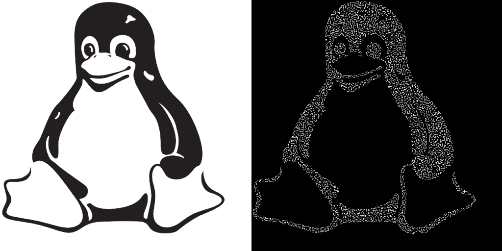

# ImageToGCODE
A simple image to GCODE converter made in java.

A program to convert images into gcode for a plotter.
The program converts image into a points, removes the excess , and makes the path.  
as this was just an experiment there is no gui or a way to configure the program exept for the config.java.  
There is also a edge detection and a dithering algoritm.